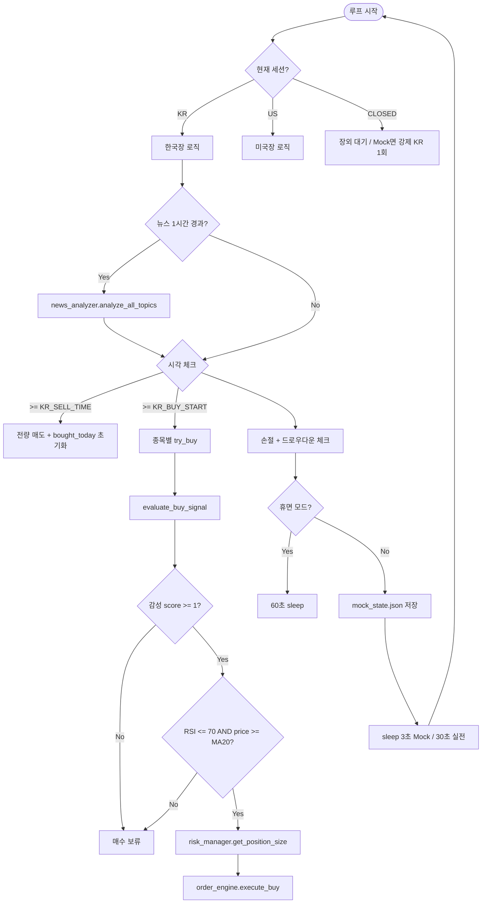

# alpha-gen

**글로벌 테마 기반 AI 자동매매 에이전트 (Python)**

뉴스 헤드라인을 Claude로 감성 분석하고, RSI·이동평균으로 기술적 필터를 거친 뒤, 리스크 규칙에 따라 한국·미국 주식을 자동 매매하는 개인용 트레이딩 봇입니다.  
Streamlit 대시보드로 포트폴리오·감성 점수·매매 이력을 실시간 모니터링할 수 있습니다.

> ⚠️ **면책**: 본 프로젝트는 교육·실험 목적의 개인 도구입니다. 실제 투자 손실에 대한 책임은 사용자에게 있습니다. 반드시 **Mock → 모의투자 → 실전** 순으로 검증하세요.  
> 📎 **세션 인수인계**: [CONTEXT.md](./CONTEXT.md) · 개발 요약: [workthrough.md](./workthrough.md)
> New: **웹 제품 MVP**가 추가되었습니다. `backend/app`은 FastAPI 기반 API/worker/SQLite 상태 저장소를, `frontend`는 웹 대시보드를 제공합니다.

---

## 목차

1. [핵심 개념](#1-핵심-개념)
2. [시스템 아키텍처](#2-시스템-아키텍처)
3. [매매 의사결정 파이프라인](#3-매매-의사결정-파이프라인)
4. [모듈별 상세 설명](#4-모듈별-상세-설명)
5. [데이터 흐름 및 프로세스 간 동기화](#5-데이터-흐름-및-프로세스-간-동기화)
6. [설정(config.py) 레퍼런스](#6-설정configpy-레퍼런스)
7. [기술 스택](#7-기술-스택)
8. [프로젝트 구조](#8-프로젝트-구조)
9. [설치 및 실행](#9-설치-및-실행)
10. [운영 모드](#10-운영-모드)
11. [알려진 한계 및 기술 부채](#11-알려진-한계-및-기술-부채)
12. [Gemini 등 AI에게 물어볼 개선 포인트](#12-gemini-등-ai에게-물어볼-개선-포인트)
13. [FAQ](#13-faq)

---

## 1. 핵심 개념

| 항목 | 내용 |
|------|------|
| **목적** | 특정 글로벌 테마(EV, AI 반도체, 우주, 방산 AI 등) 관련 뉴스가 긍정적일 때 관련 종목을 자동 매수하고, 손절·장 마감 시 자동 청산 |
| **시장** | 🇰🇷 한국장 (KIS API) + 🇺🇸 미국장 (yfinance 시세, 주문은 모의) |
| **AI 역할** | Google News RSS 헤드라인 → Claude API 감성 점수 (-2 ~ +2) |
| **기술 필터** | RSI(14), MA5/MA20 — 과매수·하락 추세 시 매수 차단 |
| **리스크** | 종목당 최대 6%, 개별 손절 -4%, 전체 드로우다운 -15% 시 휴면 모드 |
| **UI** | Streamlit 다크 테마 대시보드 (`dashboard.py`) |
| **알림** | Telegram Bot API (`notifier.py`) |

### 모니터링 종목 (config 기본값)

| 시장 | 코드 | 종목명 | 연관 뉴스 키워드 예시 |
|------|------|--------|----------------------|
| KR | `005930` | 삼성전자 | Samsung, Samsung Semiconductor |
| KR | `000660` | SK하이닉스 | SK Hynix, HBM, 반도체 |
| KR | `005380` | 현대차 | Hyundai, HMG AI |
| US | `TSLA` | Tesla | Elon Musk, Tesla, EV |
| US | `SPCE` | Virgin Galactic | Space, SpaceX, Rocket |
| US | `NVDA` | Nvidia | Nvidia, AI chip, GPU |
| US | `PLTR` | Palantir | Palantir, AI, Defense |

---

## 2. 시스템 아키텍처

### 2.1 전체 구성도

```
┌─────────────────────────────────────────────────────────────────────────┐
│                         main.py (메인 에이전트 루프)                      │
│  while True: 세션판별 → 뉴스갱신 → 매수시도 → 손절 → 드로우다운 → sleep   │
└───────┬──────────────┬──────────────┬──────────────┬────────────────────┘
        │              │              │              │
        ▼              ▼              ▼              ▼
┌──────────────┐ ┌─────────────┐ ┌─────────────┐ ┌──────────────┐
│news_analyzer │ │ technical   │ │risk_manager │ │ order_engine │
│ RSS + Claude │ │ RSI, MA     │ │ 사이징/손절  │ │ KIS / Mock   │
└──────┬───────┘ └──────┬──────┘ └─────────────┘ └──────┬───────┘
        │                │                               │
        └────────────────┼───────────────────────────────┘
                         ▼
                 ┌───────────────┐
                 │ market_data   │
                 │ 시세·잔고·세션 │
                 │ KIS/yfinance  │
                 └───────┬───────┘
                         │
         ┌───────────────┼───────────────┐
         ▼               ▼               ▼
   mock_state.json   KIS Open API    yfinance
   (Mock 동기화)     (국내장)         (미장 시세)

┌─────────────────────────────────────────────────────────────────────────┐
│              dashboard.py (Streamlit, 별도 프로세스)                      │
│  mock_state.json 로드 / 감성 차트 / 보유종목 / 5초 auto-refresh           │
└─────────────────────────────────────────────────────────────────────────┘
                         │
                         ▼
                   notifier.py → Telegram
```

### 2.2 Mermaid — 매매 의사결정 흐름



---

## 3. 매매 의사결정 파이프라인

### 3.1 매수 조건 (`main.py` → `evaluate_buy_signal`)

**두 단계를 모두 통과해야 매수합니다.**

#### (1) 뉴스 감성 (`news_analyzer.py`)

1. `config.NEWS_TOPICS` 7개 토픽별 Google News RSS 수집 (Mock 시 고정 헤드라인 풀)
2. Claude API(JSON 응답) 또는 Mock 감성 함수로 점수 산출
3. `get_stock_sentiment(code)` — 종목 `keywords`와 토픽명 매칭 후 **평균 → 반올림**
4. **매수 임계값**: `SENTIMENT_BUY_THRESHOLD = 1` (긍정 이상)

| 점수 | 라벨 | 매수 |
|------|------|------|
| +2 | 매우긍정 | ✅ (비중 100%) |
| +1 | 긍정 | ✅ (비중 60%) |
| 0 | 중립 | ❌ |
| -1 | 부정 | ❌ |
| -2 | 매우부정 | ❌ |

#### (2) 기술 지표 (`technical.py` → `get_technical_signal`)

| 조건 | 통과 기준 |
|------|-----------|
| RSI(14) | `<= RSI_OVERBOUGHT(70)` |
| 이동평균 | `현재가 >= MA20` (MA5/MA20 계산됨, MA5는 로그용) |

**가격 히스토리 소스 (세션별)**

| 모드 | KR | US |
|------|----|----|
| MOCK | `generate_mock_price_history()` | 동일 |
| 실전 | **빈 리스트** → Mock 히스토리로 폴백 | `yf_get_price_history()` |

> ⚠️ 실전 KR 모드에서 `price_history`가 `[]`로 전달되어 **항상 Mock 히스토리로 RSI/MA가 계산**됩니다. (기술 부채 #1)

#### (3) 포지션 사이징 (`risk_manager.py`)

```
max_amount = total_asset × MAX_POSITION_PCT(6%) × CONFIDENCE_SIZING[score]
qty = max_amount // current_price
```

| 감성 점수 | CONFIDENCE_SIZING | 실질 최대 비중 |
|-----------|-------------------|----------------|
| 2 | 1.00 | 6.0% |
| 1 | 0.60 | 3.6% |
| 그 외 | 0.00 | 0% |

추가 가드: `bought_today`에 이미 있으면 재매수 안 함, `SLEEP_MODE`면 스킵, 예수금 부족 시 스킵.

### 3.2 매도 조건

| 트리거 | 조건 | 함수 |
|--------|------|------|
| 장 마감 청산 | KR: `>= KR_SELL_TIME(15:15)` | `sell_all_positions("KR")` |
| 미장 마감 | KST `04:55~05:05` | `sell_all_positions("US")` |
| 개별 손절 | 평가손실 `<= -STOP_LOSS_PCT(-4%)` | `check_and_execute_stop_loss` |
| 드로우다운 | 총자산 대비 초기자본 `-15%` | `sell_all_positions` + `SLEEP_MODE` |

### 3.3 구현되어 있으나 **매수 로직에 미사용**인 기능

`technical.py`에 **변동성 돌파(Volatility Breakout)** 목표가 계산이 있습니다:

```python
# 목표가 = 시가 + (전일 고가 - 전일 저가) × K_VALUE(0.5)
calc_volatility_target(open_price, prev_high, prev_low)
```

`get_volatility_target_from_history()`, `K_VALUE` 설정은 존재하지만 **`main.py`의 `evaluate_buy_signal`에서 호출되지 않습니다.**  
README 구버전 예시의 "목표가 돌파" 메시지는 **현재 코드와 불일치**합니다.

---

## 4. 모듈별 상세 설명

### `config.py` (Git 제외, `.gitignore` 등록)

- API 키, 계좌번호, 종목, 리스크 파라미터, 장 시간, Mock 시드 가격 등 **모든 설정의 단일 진실 공급원(Single Source of Truth)**
- 저장소에 포함되지 않음 → 최초 클론 시 **직접 생성** 필요

### `main.py` — 오케스트레이터

| 전역 상태 | 용도 |
|-----------|------|
| `bought_today: set[str]` | 당일 중복 매수 방지 |
| `last_news_fetch` | 1시간 주기 뉴스 갱신 |
| `last_sentiment_results` | 토픽별 감성 캐시 |

**루프 주기**: Mock 3초 / 실전 30초

**Mock 특수 동작**:
- `CLOSED` 세션에서 KR 강제 1사이클 후 종료
- 모든 KR 종목 매수 완료 시 자동 매도 후 종료

### `news_analyzer.py`

| 기능 | 설명 |
|------|------|
| `fetch_news_headlines` | Google News RSS (`feedparser`) |
| `analyze_topic` | 1시간 TTL 메모리 캐시, 중복 헤드라인 MD5 필터 |
| `_claude_sentiment` | Anthropic API, JSON 파싱 |
| `_mock_sentiment` | `MOCK_MODE` 또는 API 키 미설정(`"여기에"` 포함) 시 사용 |
| `get_stock_sentiment` | `STOCK_TOPIC_MAP` 우선 → 없으면 keywords ↔ topic 부분 일치 폴백 |

**토픽 ↔ 종목 매핑**: `config.STOCK_TOPIC_MAP`에 종목별 토픽을 명시합니다. 미매핑 종목만 keywords 부분 일치 폴백을 사용합니다.

### `technical.py`

- `pandas-ta-classic` 우선, 실패 시 수동 RSI/MA 계산
- `generate_mock_price_history`: 랜덤워크 ±1.5% 시뮬레이션

### `market_data.py`

| 함수 | Mock | KR 실전 | US 실전 |
|------|------|---------|---------|
| `get_price` | `mock_get_price` (랜덤워크 ±0.5%) | `kis_get_price` | `yf_get_price` (USD×1350) |
| `get_balance` | `mock_get_balance` | `kis_get_balance` | **동일하게 KIS 잔고** |
| `get_market_session` | KST 시각 기준 KR/US/CLOSED | 동일 | 동일 |

**Mock 상태 영속화**: `save_mock_state()` / `load_mock_state()` → `mock_state.json`

### `order_engine.py`

| 세션 | Mock | KR 실전 | US (MOCK_MODE=False) |
|------|------|---------|----------------------|
| 매수 | `mock_buy` | `kis_buy` (시장가) | **`mock_buy` (모의)** |
| 매도 | `mock_sell` (실현손익 계산) | `kis_sell` (pnl=0 반환) | **`mock_sell` (모의)** |

> ⚠️ 미국장은 실전 모드에서도 **KIS 해외주식 API 없이 Mock 주문**만 수행합니다.

### `risk_manager.py`

- `SLEEP_MODE`, `INITIAL_CAPITAL` — 프로세스 메모리 전역 (재시작 시 초기화)
- `check_stop_loss`: `eval_price` vs `avg_price` 기준
- `check_max_drawdown`: 초기 자본 대비 -15% 시 휴면

### `notifier.py`

- `TELEGRAM_ENABLED` + 토큰/ID 유효 시 Telegram HTML 메시지
- 미설정 시 `[TG-SKIP]` 콘솔 출력만

### `dashboard.py`

- Streamlit wide layout, 5초 `st.rerun()` auto-refresh
- Mock: `mock_state.json` 로드
- 실전: `market_data.get_balance("KR")` only (미장 포지션 미반영 가능)
- 감성: `market_data._shared_sentiments` 참조 (**main.py가 설정해야 함**)
- 차트: Mock 가격 랜덤 시뮬레이션 (실시간 틱 아님)

---

## 5. 데이터 흐름 및 프로세스 간 동기화

### 5.1 `mock_state.json` 스키마

```json
{
  "cash": 10000000,
  "holdings": {
    "005380": {
      "code": "005380",
      "name": "현대차",
      "qty": 2,
      "avg_price": 239431,
      "eval_price": 238949
    }
  },
  "prices": { "005930": 74798.82, "...": 0.0 },
  "trade_log": [
    {
      "time": "2026-05-23 12:10:59",
      "action": "매수",
      "name": "현대차",
      "code": "005380",
      "qty": 2,
      "price": 239431,
      "amount": 478862,
      "pnl": null
    }
  ],
  "last_updated": "2026-05-23 12:13:47"
}
```

### 5.2 main ↔ dashboard 동기화

```
main.py                          dashboard.py
   │                                  │
   ├─ refresh_news_sentiment()        │
   │    └─ market_data._shared_sentiments = results  (메모리)
   │                                  │
   ├─ save_mock_state() ─────────────►├─ load_mock_state()
   │    (mock_state.json)            │    (5초마다 rerun)
   │                                  │
   └─ order_engine.mock_* ───────────►└─ trade_log, holdings 표시
```

**주의사항**:
- `_shared_sentiments`는 `market_data.py`에 **초기값이 없음**. `main.py` 실행 전에 대시보드만 켜면 `AttributeError` 가능.
- `risk_manager.SLEEP_MODE`는 JSON에 저장되지 않아 **대시보드와 main 프로세스 간 휴면 상태 불일치** 가능.

---

## 6. 설정(config.py) 레퍼런스

> `config.py`는 Git에 올라가지 않습니다. 아래 항목을 참고해 직접 생성하세요.

### 6.1 모드 스위치

| 변수 | 기본 권장 | 설명 |
|------|-----------|------|
| `MOCK_MODE` | `True` | 전체 시뮬레이션 |
| `IS_REAL_TRADING` | `False` | `False`=모의투자 URL, `True`=실전 URL |

### 6.2 API

| 변수 | 용도 |
|------|------|
| `KIS_APP_KEY`, `KIS_APP_SECRET` | 한국투자증권 Open API |
| `ACCOUNT_NO`, `ACCOUNT_CODE` | 계좌 (앞 8자리 + 상품코드) |
| `ANTHROPIC_API_KEY` | Claude 감성 분석 |
| `CLAUDE_MODEL` | 예: `claude-3-5-haiku-20241022` |
| `TELEGRAM_BOT_TOKEN`, `TELEGRAM_CHAT_ID` | 알림 |

### 6.3 리스크 파라미터

| 변수 | 기본값 | 의미 |
|------|--------|------|
| `TOTAL_CAPITAL` | 10,000,000 | 추적용 원금 |
| `MOCK_INITIAL_CASH` | 10,000,000 | Mock 초기 예수금 |
| `MAX_POSITION_PCT` | 0.06 | 종목당 최대 6% |
| `STOP_LOSS_PCT` | 0.04 | -4% 손절 |
| `MAX_DRAWDOWN_PCT` | 0.15 | -15% 휴면 |
| `SENTIMENT_BUY_THRESHOLD` | 1 | 최소 감성 점수 |
| `MOCK_CONTINUOUS` | `True` | Mock 장외에도 3초 루프 (`False`면 1회 종료) |
| `STOCK_TOPIC_MAP` | dict | 종목 코드 → 뉴스 토픽 리스트 |

### 6.4 장 시간 (KST)

| 변수 | 값 | 의미 |
|------|-----|------|
| `KR_MARKET_OPEN` ~ `CLOSE` | 09:00 ~ 15:30 | 국장 세션 |
| `KR_BUY_START` | 09:05 | 매수 감시 시작 |
| `KR_SELL_TIME` | 15:15 | 전량 매도 |
| `US_MARKET_OPEN` ~ `CLOSE` | 22:30 ~ 05:00 | 미장 세션 (자정 걸침) |

### 6.5 config.py 최소 템플릿

```python
MOCK_MODE = True
IS_REAL_TRADING = False
MOCK_CONTINUOUS = True

KIS_APP_KEY = "여기에_APP_KEY"
KIS_APP_SECRET = "여기에_APP_SECRET"
ACCOUNT_NO = "여기에_계좌번호_앞8자리"
ACCOUNT_CODE = "01"

ANTHROPIC_API_KEY = "여기에_Claude_API_키"
CLAUDE_MODEL = "claude-3-5-haiku-20241022"

TELEGRAM_ENABLED = True
TELEGRAM_BOT_TOKEN = "여기에_봇_토큰"
TELEGRAM_CHAT_ID = "여기에_채팅_ID"

# 나머지는 config.example.py 의 KR_STOCKS, STOCK_TOPIC_MAP, 리스크·장시간 등 참고
```

---

## 7. 기술 스택

| 구분 | 라이브러리 | 버전 (requirements.txt) |
|------|------------|-------------------------|
| HTTP | requests | >= 2.31.0 |
| UI | streamlit, plotly | >= 1.35.0, >= 5.18.0 |
| 데이터 | pandas | >= 2.0.0 |
| AI | anthropic | >= 0.25.0 |
| 뉴스 | feedparser | >= 6.0.0 |
| 미장 시세 | yfinance | >= 0.2.40 |
| 기술지표 | pandas-ta-classic | >= 0.3.14b |

**런타임**: Python 3.9+ (venv 기준 3.9)  
**타임존**: `zoneinfo.Asia/Seoul` (KST)  
**브로커 API**: 한국투자증권 KIS Open API (OAuth2 Bearer, 23시간 토큰 캐시)

---

## 8. 프로젝트 구조

```
alpha-gen/
├── config/                # 공통 설정 패키지 (env override 지원)
├── backend/
│   └── app/               # FastAPI 백엔드, 서비스 계층, SQLite 저장소
├── frontend/              # 웹 대시보드 SPA
├── config.py              # ⭐ 설정 (Git 제외, 직접 생성)
├── config.example.py      # 설정 템플릿 (cp 후 config.py 로 복사)
├── main.py                # 메인 에이전트 루프
├── dashboard.py           # Streamlit 대시보드 (Plotly equity)
├── news_analyzer.py       # RSS + Claude 감성 분석
├── technical.py           # RSI, MA, 변동성 돌파
├── market_data.py         # 시세·잔고·세션·Mock 상태
├── market_adapters.py     # Mock/KIS/yfinance 어댑터
├── order_engine.py        # KIS/Mock 주문
├── risk_manager.py        # 포지션 사이징·손절·드로우다운
├── notifier.py            # 텔레그램 알림
├── agent_logging.py       # RotatingFileHandler 로그
├── backtest.py            # 간이 백테스트
├── scripts/kis_smoke_test.py  # KIS 모의투자 E2E 스모크
├── mock_state.json        # 런타임 상태 (감성·equity_history 등)
├── tests/                 # pytest (18개)
├── CONTEXT.md             # 세션 인수인계 문서
├── requirements.txt
├── README.md              # 본 문서
├── workthrough.md         # 개발 요약
└── venv/                  # 가상환경 (Git 제외)
```

### 웹 제품 MVP 실행

```bash
# 의존성 설치
py -m pip install -r requirements.txt

# 설정 템플릿 복사 후 값 입력
copy .env.example .env

# 웹 제품 실행
py -m uvicorn backend.app.main:app --host 127.0.0.1 --port 8000

# 접속
# http://127.0.0.1:8000
```

보조 점검 스크립트:

```bash
py scripts/setup_check.py
py scripts/kis_smoke_test.py
py scripts/claude_smoke_test.py
```

---

## 9. 설치 및 실행

### 9.1 설치

```bash
cd /path/to/alpha-gen
python3 -m venv venv          # 최초 1회
source venv/bin/activate
pip install -r requirements.txt
```

새 웹 제품 경로는 `.env`를 우선 사용합니다. `.env.example`을 복사한 뒤 `KIS_*`, `ACCOUNT_NO`, `ANTHROPIC_API_KEY`를 입력하세요.

### 9.2 자동매매 엔진

```bash
source venv/bin/activate
python main.py
```

**Mock 정상 실행 시 예시 로그** (현재 코드 기준):

```
[2026-05-23 12:10:00] ℹ️  [INFO] [MOCK] ─── 🇰🇷 한국장 세션 (12:10)
[2026-05-23 12:10:00] 📰 [NEWS] [MOCK]   [신규] SK Hynix HBM: +2 (매우긍정) | ...
[2026-05-23 12:10:01] 🤖 [AI] [MOCK] [SK하이닉스] 감성: +2 (매우긍정)
[2026-05-23 12:10:01] 🤖 [AI] [MOCK] [SK하이닉스] 기술지표: RSI=58.2 | RSI 정상(58.2) | MA 상향배열(...)
[2026-05-23 12:10:01] 🟢 [BUY] [MOCK] [SK하이닉스] 매수 완료: 3주 × 178,694원
```

종료: `Ctrl + C`

### 9.3 대시보드 (별도 터미널)

```bash
source venv/bin/activate
streamlit run dashboard.py
# → http://localhost:8501
```

**권장 실행 순서**: `main.py` 먼저 → `dashboard.py` (감성 데이터·mock_state 동기화)

---

## 10. 운영 모드

| 단계 | `MOCK_MODE` | `IS_REAL_TRADING` | 시세 | 주문 | 뉴스/AI |
|------|-------------|-------------------|------|------|---------|
| 1. Mock 테스트 | `True` | 무관 | 랜덤워크 | Mock | Mock 감성 |
| | | | | | `MOCK_CONTINUOUS=True` 시 장외에도 3초 루프 |
| 2. 모의투자 | `False` | `False` | KIS/yfinance | KIS 모의 TR | RSS + Claude |
| 3. 실전 | `False` | `True` | KIS/yfinance | KIS 실전 TR | RSS + Claude |

**미장 주문**: 2·3단계에서도 현재 코드는 **Mock 주문**만 수행 (KIS 해외주식 미연동).

---

## 11. 알려진 한계 및 기술 부채

아래는 코드 리뷰 기준으로 확인된 **현재 상태**입니다. 개선 논의 시 참고용입니다.

| # | 영역 | 문제 | 영향 |
|---|------|------|------|
| 1 | 기술지표 | 실전 KR `price_history` 부족 시 Mock RSI 폴백 | 실제 차트와 괴리 가능 |
| 2 | 전략 | 변동성 돌파 | ✅ `evaluate_buy_technicals()` 연동 |
| 3 | 미장 | US → Mock 주문 | 실전 모드에서도 미장 가상 체결 |
| 4 | 잔고 | US 세션도 KIS 국내 잔고만 | 미장 포지션·USD 미반영 |
| 5 | 환율 | `_USD_KRW` 고정 | 미장 원화 환산 오차 |
| 6 | 동기화 | dashboard 단독 실행 | `mock_state.json` 선 로드 권장 |
| 7 | 매핑 | 토픽↔종목 | ✅ `STOCK_TOPIC_MAP` (미매핑만 폴백) |
| 8 | 테스트 | 회귀 | ✅ pytest 18개 + KIS 스모크 (키 있을 때) |
| 9 | 로깅 | 운영 | ✅ `agent_logging.py` |
| 10 | 온보딩 | config | ✅ `config.example.py` |
| 11 | API 비용 | Claude 8토픽/시간 | 배치·캐시로 완화 |
| 12 | 대시보드 | 종목 차트 | equity는 Plotly 실데이터, 종목 차트는 랜덤 시뮬 |
| 13 | KIS 매도 | `pnl=0` 반환 | 텔레그램 실현손익 부정확 |
| 14 | KIS E2E | 모의투자 | ✅ `scripts/kis_smoke_test.py` |

---

## 12. Gemini 등 AI에게 물어볼 개선 포인트

아래 프롬프트를 복사해 Gemini(또는 다른 LLM)에 붙여넣으면 구조화된 피드백을 받기 쉽습니다.

---

### 프롬프트 템플릿

```
다음은 Python 기반 개인용 주식 자동매매 프로젝트 "alpha-gen"의 README입니다.
아키텍처, 매매 파이프라인, 알려진 기술 부채를 검토하고 개선안을 제시해 주세요.

[요청 형식]
1. 아키텍처: 모듈 분리·확장성·단일 책임 관점 평가 및 리팩터링 제안
2. 매매 전략: 감성+RSI/MA 조합의 논리적 허점, 백테스트 가능한 구조로의 전환 방안
3. 실전 안정성: KIS API 오류 처리, 재시도, idempotent 주문, 장애 복구
4. 미장: yfinance 시세 + Mock 주문 현 구조의 문제와 KIS 해외주식 연동 대안
5. 리스크: 포지션 사이징·손절·드로우다운 규칙의 업계 best practice 비교
6. AI 비용: Claude 호출 최적화(배치, 캐시, 모델 선택, 로컬 감성 모델 대체)
7. 운영: 로깅, 모니터링, config 관리, 테스트 전략
8. 대시보드: main.py와의 상태 동기화 개선(Redis/SQLite/파일 락 등)
9. 우선순위: Quick win / Medium / Long-term 로 3단계 로드맵

[README 전문]
(이 README.md 파일 전체를 붙여넣기)
```

---

### 세부 질문 예시 (주제별)

**전략**
- 감성 점수 평균·반올림 방식이 매수 타이밍에 미치는 왜곡은?
- 변동성 돌파를 감성 필터와 어떻게 결합하는 게 합리적인가?
- 당일 전량 청산(데이트레이딩) vs 스윙 보유 중 어느 쪽이 이 구조에 맞는가?

**엔지니어링**
- `main.py` 400줄 단일 루프를 이벤트 기반/스케줄러(APScheduler)로 나눌 필요가 있는가?
- Mock ↔ 실전 분기를 Strategy 패턴으로 통합하는 설계안은?
- `mock_state.json` 대신 SQLite가 나은 이유와 스키마 제안은?

**리스크**
- -4% 손절 + -15% 드로우다운이 중복인가, 상호보완인가?
- `bought_today`를 영속화하지 않을 때의 리스크는?
- 휴면 모드 자동 해제 조건을 둬야 하는가?

**AI/뉴스**
- Google News RSS만으로 충분한가? 한국어 뉴스·공시 연동 방안은?
- Claude JSON 파싱 실패 시 fallback 전략은?
- 토픽 7개를 종목별로 재설계한다면 어떤 매핑 테이블이 좋은가?

**규제·실무**
- 개인 알고리즘 매매 시 주의할 점(한국 기준 개괄)
- 모의투자와 실전 TR ID 전환 시 체크리스트

---

## 13. FAQ

| 증상 | 원인 | 해결 |
|------|------|------|
| `ModuleNotFoundError: streamlit` | 의존성 미설치 | `pip install -r requirements.txt` |
| `ModuleNotFoundError: config` | config.py 없음 | 섹션 6 템플릿으로 생성 |
| `(venv)` 없음 | 가상환경 비활성 | `source venv/bin/activate` |
| 대시보드 감성 0만 표시 | main 미실행 또는 `_shared_sentiments` 없음 | main.py 먼저 실행 |
| 텔레그램 안 옴 | 토큰/ID 미설정 | `TELEGRAM_*` 확인, `"여기에"` 문자열 제거 |
| KIS 인증 오류 | 키/계좌/모의·실전 URL 불일치 | `IS_REAL_TRADING`과 `KIS_URL` 확인 |
| Mock인데 예수금 이상 | 이전 `mock_state.json` 잔존 | 파일 삭제 후 재실행 |
| Mock 금방 종료 | `MOCK_CONTINUOUS=False` | `True`(기본)면 장외에도 3초 루프 |

---

## 라이선스 / 기여

현재 개인 실험 프로젝트입니다. 외부 기여 가이드는 없습니다.

**문서 버전**: 2026-05-23 · 코드베이스 `main.py`, `dashboard.py` 등 9개 Python 모듈 기준
